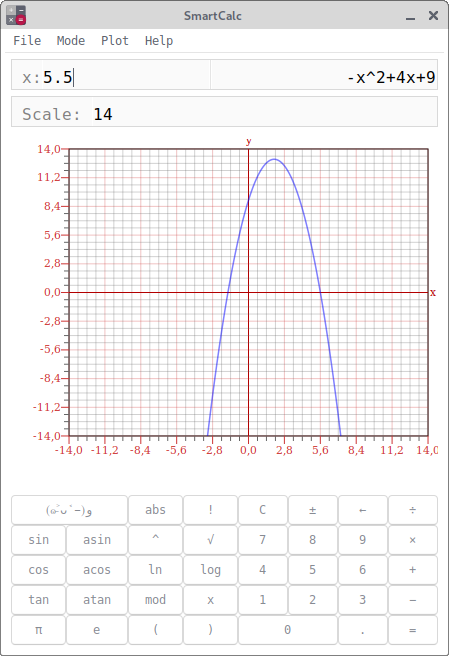

# Calculator



## General Information

> *Calculator* calculates the expression specified in infix notation, uses the shunting yard algorithm. It has 4 modes: basic, usual, credit and deposit. In the basic mode, it builds a plot a function specified in infix notation.

## Program features 

### Basic

- The program developed in C language of C11 standard using gcc compiler
- Both integers and real numbers with a dot can be input into the program
- The calculation done after you complete entering the calculating expression and press the `=` symbol or `Enter` key
- Erase the input field with the `<-` button or `Backspace` , clear the field with the `C` button or  `Esc` 
- Calculating arbitrary bracketed arithmetic expressions in infix notation
- Calculate arbitrary bracketed arithmetic expressions in infix notation with substitution of the value of the variable _x_ as a number, show/hide the input field by accelerator `F2`
- Plotting a graph of a function given by an expression in infix notation with the variable _x_ (with coordinate axes, mark of the used scale and an adaptive grid)
- The plotting area can be hidden or shown by pressing `F3`
- It is possible to change the scale, to change the value, press `Enter`
- Function domain and code domain are limited to numbers from -1000000 to 1000000
- Arithmetic expressions in brackets in infix notation support the following arithmetic operations and mathematical functions:

- Arithmetic operators:

| Operator name | Infix notation <br /> (Classic) | Prefix notation <br /> (Polish notation) |  Postfix notation <br /> (Reverse Polish notation) |      
| --------- | ------ | ------ | ------ |      
| Brackets | (a + b) | (+ a b) | a b + |      
| Addition | a + b | + a b | a b + |     
| Subtraction | a - b | - a b | a b - |     
| Multiplication | a * b | * a b | a b * |     
| Division | a / b | / a b | a b \ |      
| Power | a ^ b | ^ a b | a b ^ |      
| Modulus | a mod b | mod a b | a b mod |     
| Unary plus | +a | +a | a+ |      
| Unary minus | -a | -a | a- |   
|Factorial | !a | !a | a!

- Functions:

| Function description | Function |      
| ------ | ------ |      
| Computes cosine | cos(x) |      
| Computes sine | sin(x) |      
| Computes tangent | tan(x) |      
| Computes arc cosine | acos(x) |      
| Computes arc sine | asin(x) |      
| Computes arc tangent | atan(x) |      
| Computes square root | sqrt(x) |      
| Computes natural logarithm | ln(x) |     
| Computes common logarithm | log(x) |
| Computes module | abs(x) |

### Credit

- Input: total credit amount, term, interest rate, type (annuity, differentiated)
- Output: monthly payment, overpayment on credit, total payment

### Deposit

- Input: deposit amount, deposit term, interest rate, tax rate, periodicity of payments, capitalization of interest, replenishments list, partial withdrawals list
- Output: accrued interest, tax amount, deposit amount by the end of the term

## Build/Installation

> Calculator requires GTK+ (>= 3.22)  and GLib (>=2.76) libraries. 

*Linux*
```
$ sudo apt-get install gtk+-3.0 libsoup-3.0 json-glib-1.0 glib-2.0 gobject-2.0
$ ldconfig
```

*MacOS*
```
$ brew install gtk+3 glib libsoup json-glib pango 
```

Simple install procedure:

```
$ make
$ make install
```

> Installation in directory `build/Calculator/`

## Target

Testing is performed using the check.h library:

```
$ make test
```

Checking code coverage:

```
$ make gcov_report
```

Create a distribution tar file for this project:

```
$ make dist 
```
> Will be created a file name `Calculator.tar`